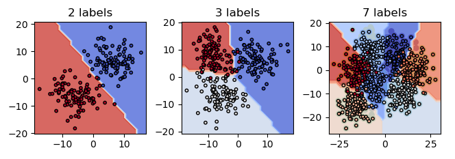

# SVM Classification Project

Support Vector Machine is supervised learning model, which can be used in classification and regression analysis.
This project contains examples of SVM implementation.

## Used Technologies

Python:
- sklearn
- numpy
- matplotlib
- random

## Classification

SVM is one of the most popular Machine Learning methods for classification.
In this project the `scikit-learn` library was used. Class `SVC()` contains a few kernel options.

In the experiments, the class was as follows: `clf = svm.SVC(kernel="poly", C=10)`.

### Creating Data

The data was created for 3 different experiments:
- 2 labels
- 3 labels
- 7 labels

Randomly distributed points with (x, y) coordinates were created using the `random.gauss()` function. 

### Experiment

## Regression
To be continued...
